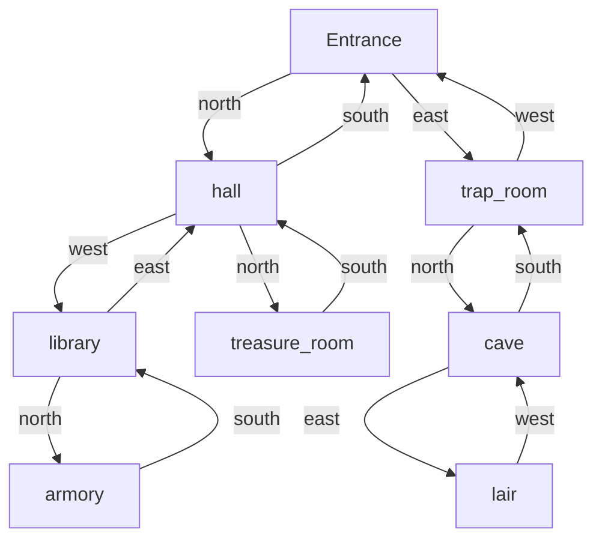

# project1_Tsyvunin_Vitaliy_M25-555

## Labyrinth Game
Игра создана на основе функционального программирования языка Python.

### Описание игры
Карта игры:


Цель: вам необходимо открыть сундук и забрать главные сокровища

Вас ждут загадки, ловушки и предметы, которую могут помочь вам на пути к цели.

### Команды для работы с проектом
```bash
# Установить зависимости
make install

# Запустить проект
make project

# Собрать пакет
make build

# Проверить публикацию (dry-run)
make publish

# Установить собранный пакет локально
make package-install

# Проверить стиль кода
make lint
```

## Пример работы игры
[](https://asciinema.org/a/9F6JYHb8sQVnFY8WeHfae40Wf)